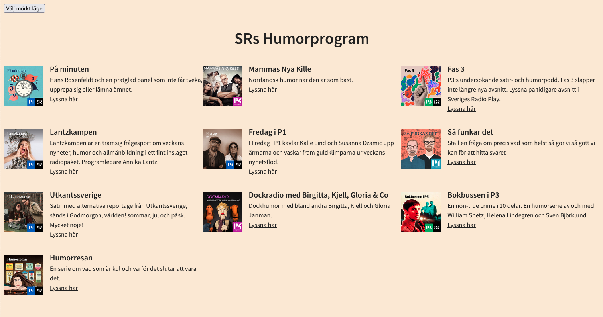
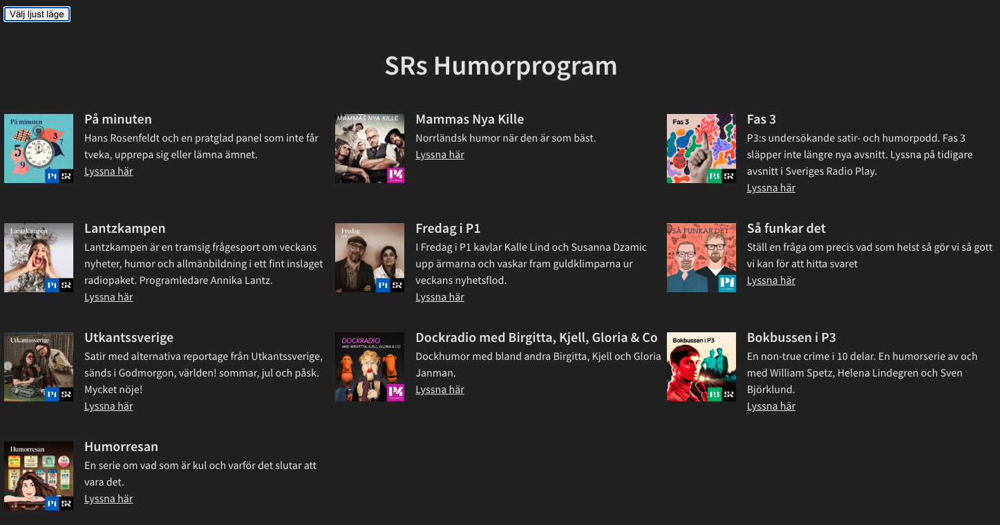
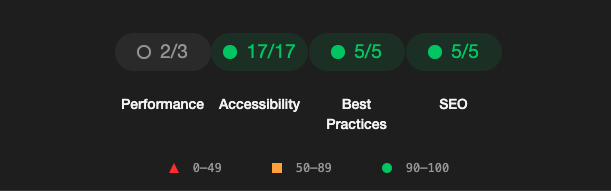

# SR Humorprogram

This project was developed by a teacher at Medieinstitutet.

The aim for us students was to fix the smelly code and make the program work.

Its a list of funny radio programs and it includes pod cover, heading and description.
Every pod contains a direct link to "Sveriges Radio" where you'll be able to listen to the episode you want.
The page is available in light and dark mode.

### Requirements for this assigment

- Make the project work
- Conver CSS to Sass
- Consistent naming in CSS
- Convert project to TypeScript
- Consistent code quality
- Fix mobileview
- Change language
- Clear logging
- Dokumentation
- Add alt texts to images due to a11y
- Refactor functions
- Eliminate unnessacary code
- Clear code (tabindex)

## Live published site

[Click here for live published version](https://mikaelakihl.github.io/mi-workmethods-assignment1-codesmells/)

**Language: Swediish**

## Screenshots




## Tech Stack

**HTML** | **JavaScript** | **TypeScript** | **SCSS** | **Prettier** | **EsLint** | **Vite**

## Install project

### Prerequisites

To run the project locally, you need the following tools installed:

- [Node.js](https://nodejs.org/)
- [npm](https://www.npmjs.com/)
- A modern browser (Chrome, Firefox, Edge)

### Installation

Follow these steps to set up the project on your local machine:

1. Clone this repository:

   ```bash
   git clone https://github.com/username/project-name.git

   ```

2. Navigate into the project directory:

   ```bash
   cd project-name

   ```

3. Install dependencies via npm:

   ```bash
   npm install

   ```

4. Start the development server:

   ```bash
   npm run dev
   ```

### Lighthouse Analyze


